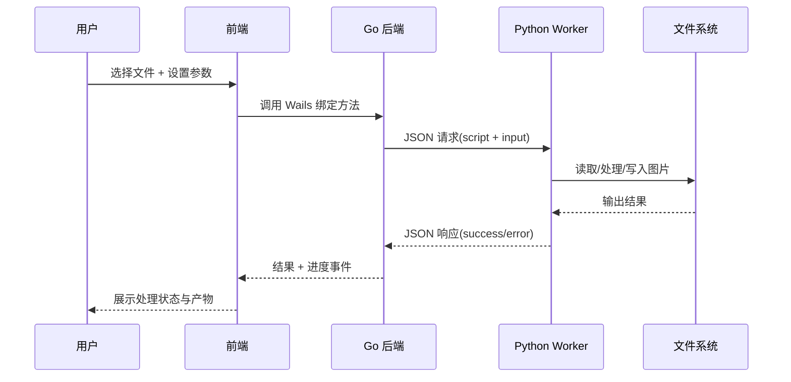

<p align="center">
  
</p>

<h1 align="center">ImageFlow</h1>

<p align="center">
  一款面向桌面端的图像处理工作台：格式转换、压缩、GIF、PDF、水印、调色、滤镜、元数据一站式完成。
</p>

<p align="center">
  
  
  
  
  
</p>

---

## 项目定位

ImageFlow 采用 **Go + Python + React + Wails** 混合架构：
- **Go**：负责桌面应用生命周期、任务调度、并发执行、错误恢复。
- **Python**：负责图像算法和文件处理（Pillow/ReportLab/piexif 等）。
- **React**：负责可视化交互界面与实时进度反馈。
- **Wails**：负责前后端桥接，形成桌面端一体化体验。

适用场景：
- 批量格式转换与压缩
- 图像资料整理（命名模板、目录结构保留）
- 社媒素材处理（滤镜、水印、调色）
- 动图和文档产出（GIF、PDF）
- 元数据查看、编辑与隐私清理

---

## 图解架构




---

## 功能矩阵（图文版）

| 模块 | 主要能力 | 关键实现 |
|---|---|---|
| 格式转换 | JPG/PNG/WEBP/AVIF/TIFF/BMP/ICO 输出；支持缩放/长边/固定尺寸；可选保留 EXIF | `backend/services/converter.go` + `backend/python/converter.py` |
| 图片压缩 | 5 档压缩策略（无损到极限）；可指定目标体积；支持元数据剥离 | `compressor.go` + `compressor.py`（MozJPEG/PNGQuant/OxiPNG/Pillow） |
| 转 PDF | 多图合并 PDF；页面尺寸、方向、边距、排版网格 | `pdf_generator.go` + `pdf_generator.py` |
| GIF 工具 | 拆帧、倒放、变速、多图合成 GIF | `gif_splitter.go` + `gif_splitter.py` |
| 信息查看 | 读取格式/尺寸/位深/EXIF/直方图等信息 | `info_viewer.go` + `info_viewer.py` |
| 元数据处理 | EXIF 编辑；隐私清理（Strip Metadata） | `app.go` + `metadata.go` + `metadata_tool.py` |
| 图片水印 | 文字/图片水印、九宫格定位、平铺、混合模式、阴影 | `watermark.go` + `watermark.py` |
| 图片调整 | 旋转、翻转、亮度/对比度/饱和度/色相/锐度、裁剪比例 | `adjuster.go` + `adjuster.py` |
| 图片滤镜 | 基础滤镜 + 高级滤镜 + 30+ 预设滤镜 | `filter.go` + `filter.py` |

---

## 技术栈与依赖

### 前端
- React `19.x`
- TypeScript `5.x`
- Vite `6.x`
- Tailwind CSS `4.x`

### 后端
- Go `1.24`
- Wails `v2.11.0`

### Python 图像栈
- Python `>=3.10`
- Pillow
- reportlab / svglib / lxml
- piexif / exifread
- mozjpeg-lossless-optimization / imagequant / pyoxipng（压缩增强）

---

## 目录结构

```text
Imageflow/
├── frontend/                    # React + Vite UI
│   ├── components/              # 核心界面组件
│   ├── wailsjs/                 # Wails 自动生成绑定
│   └── ...
├── backend/                     # Go + Wails 后端
│   ├── app.go                   # 对外绑定方法（前端调用入口）
│   ├── main.go                  # Wails 应用入口
│   ├── services/                # 各业务服务
│   ├── utils/                   # Python执行器、设置存储、路径工具等
│   ├── models/                  # 请求/响应结构定义
│   └── python/                  # Python处理脚本
│       ├── worker.py            # 长驻 Worker（减少进程开销）
│       ├── converter.py
│       ├── compressor.py
│       ├── pdf_generator.py
│       ├── gif_splitter.py
│       ├── info_viewer.py
│       ├── metadata_tool.py
│       ├── watermark.py
│       ├── adjuster.py
│       └── filter.py
├── docs/                        # 架构与需求文档
├── pyproject.toml               # Python依赖（uv）
└── README.md
```

---

## 快速开始

### 1) 环境准备

- Node.js（建议 LTS）
- Go `1.24+`
- Python `3.10+`
- Wails CLI

### 2) 安装依赖

```bash
# 前端依赖
cd frontend
npm install

# Python 依赖（推荐）
cd ..
uv sync

# Go 依赖
cd backend
go mod download
```

### 3) 启动开发

```bash
# 仓库根目录
wails dev
```

### 4) 构建发布

```bash
# 构建前端
cd frontend
npm run build

# 构建桌面应用
cd ..
wails build
```

---

## 支持格式（当前代码实现）

### 输入（拖拽/目录展开层面）
- `jpg`, `jpeg`, `png`, `webp`, `gif`, `bmp`, `tiff`, `tif`, `heic`, `heif`, `svg`

### 转换输出（转换模块）
- `jpg`, `jpeg`, `png`, `webp`, `bmp`, `tiff`, `tif`, `ico`, `avif`

### GIF 帧导出格式
- `png`, `jpg/jpeg`, `bmp`

---

## 并发与性能设计

- 默认并发 `8`，可在设置中调节 `1-32`。
- `PythonExecutorPool` 支持多执行器并行调度。
- `worker.py` 长驻进程 + 模块预热，降低重复启动成本。
- 批处理任务提供进度事件回传，前端可实时展示。
- 大图预览支持阈值控制，防止前端内存飙升。

---

## 配置说明

### 环境变量

| 变量名 | 说明 |
|---|---|
| `IMAGEFLOW_PYTHON_EXE` | 指定 Python 解释器（必须是 Python 3） |
| `IMAGEFLOW_SCRIPTS_DIR` | 指定 Python 脚本目录（默认自动探测） |
| `IMAGEFLOW_FILE_LOG=1` | 启用文件日志 |
| `IMAGEFLOW_PREVIEW_MAX_BYTES` | 预览文件大小阈值（字节） |
| `IMAGEFLOW_PROFILE=1` | 打开 Python 侧性能/能力检测日志 |

### 全局设置（UI）

| 字段 | 默认值 | 说明 |
|---|---|---|
| `max_concurrency` | `8` | 并发数，范围 `1-32` |
| `output_prefix` | `IF` | 输出前缀 |
| `output_template` | `{prefix}{basename}` | 输出命名模板 |
| `preserve_folder_structure` | `true` | 保留原目录层级 |
| `conflict_strategy` | `rename` | 冲突处理策略（当前固定 rename） |

设置文件位置：`os.UserConfigDir()/imageflow/settings.json`  
Windows 常见路径示例：`C:/Users/<用户名>/AppData/Roaming/imageflow/settings.json`

---

## 输出命名模板

`output_template` 支持占位符：

| 占位符 | 说明 | 示例 |
|---|---|---|
| `{prefix}` | 输出前缀（会自动追加下划线） | `IF_` |
| `{basename}` | 原文件名（不带扩展名） | `photo_001` |
| `{op}` | 操作类型 | `convert` |
| `{date:YYYYMMDD}` | 日期格式化 | `20260220` |
| `{time:HHmmss}` | 时间格式化 | `235959` |
| `{seq:3}` | 序号补零 | `001` |

示例模板：

```text
{prefix}{basename}_{op}_{date:YYYYMMDD}_{seq:3}
```

---

## 测试与质量检查

```bash
# Python 单元测试
python -m unittest discover -s backend/python/tests

# Go 单元测试
cd backend
go test ./...

# 前端构建检查
cd ../frontend
npm run build
```

---

## 常见问题（FAQ）

### 1. 启动时找不到 Python
- 先执行 `uv sync` 创建 `.venv`
- 或显式设置 `IMAGEFLOW_PYTHON_EXE` 为 Python 3 路径

### 2. 找不到 Python 脚本目录
- 检查 `backend/python` 是否完整
- 必要时设置 `IMAGEFLOW_SCRIPTS_DIR`

### 3. 打包后界面空白或资源缺失
- 先执行 `cd frontend && npm run build`
- 再执行 `wails build`

### 4. 批量任务速度不稳定
- 调整 `max_concurrency`（通常 4-16 更稳）
- 关闭不必要的大图预览，降低内存压力

---

## 开发文档

- 后端架构：`docs/BACKEND_ARCHITECTURE.md`
- 后端说明：`docs/BACKEND_README.md`
- 压缩方案：`docs/image-compression.md`
- 综合需求：`docs/ImageFlow 综合需求文档.md`
- 开发指南：`docs/ImageFlow_Development_Guide_Final.md`
- 交互方案：`docs/Wails v3 React + Go 拖拽文件交互技术方案.md`

---

## 贡献建议

欢迎提交 Issue / PR。推荐流程：

1. Fork 并创建特性分支
2. 补充对应测试（优先 Python 处理脚本测试）
3. 提交前执行构建与测试
4. PR 中附上改动说明和验证步骤

---

## License

本项目采用 **MIT License**，详见 `LICENSE`。
