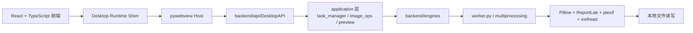
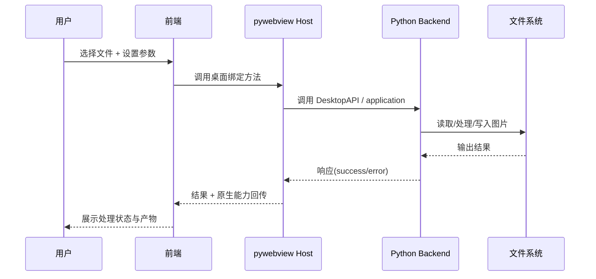

<p align="center">
  
</p>

<h1 align="center">ImageFlow</h1>

<p align="center">
  一款面向桌面端的图像处理工作台：格式转换、压缩、GIF、PDF、水印、调色、滤镜、元数据一站式完成。
</p>

<p align="center">
  
  
  
  
  
</p>

---

## 项目定位

ImageFlow 当前采用 **纯 Python 后端 + React 前端 + pywebview 宿主** 架构：
- **backend/main.py**：桌面应用入口，负责窗口启动与宿主生命周期。
- **backend/api/**：统一对前端暴露的桌面 API，保持原有调用面兼容。
- **backend/application/**：任务管理、批处理、预览与执行编排。
- **backend/engines/**：图像能力引擎，负责转换、压缩、GIF、PDF、水印、调色、滤镜、元数据等核心处理。
- **React**：保留原有前端界面与交互。
- **pywebview**：提供桌面窗口、原生对话框与拖拽桥接。

适用场景：
- 批量格式转换与压缩
- 图像资料整理（命名模板、目录结构保留）
- 社媒素材处理（滤镜、水印、调色）
- 动图和文档产出（GIF、PDF）
- 元数据查看、编辑与隐私清理

---

## 图解架构


```mermaid
flowchart LR
    UI[React + TypeScript 前端] --> Bridge[Desktop Runtime Shim]
    Bridge --> Host[pywebview Host]
    Host --> API[backend/api/DesktopAPI]
    API --> App[application 层<br/>task_manager / image_ops / preview]
    App --> Engines[backend/engines]
    Engines --> Worker[worker.py / multiprocessing]
    Worker --> Libs[Pillow + ReportLab + piexif + exifread]
    Libs --> IO[本地文件读写]
```


```mermaid
sequenceDiagram
    participant User as 用户
    participant FE as 前端
    participant Host as pywebview Host
    participant Py as Python Backend
    participant FS as 文件系统

    User->>FE: 选择文件 + 设置参数
    FE->>Host: 调用桌面绑定方法
    Host->>Py: 调用 DesktopAPI / application
    Py->>FS: 读取/处理/写入图片
    FS-->>Py: 输出结果
    Py-->>Host: 响应(success/error)
    Host-->>FE: 结果 + 原生能力回传
    FE-->>User: 展示处理状态与产物
```

---

## 功能矩阵（图文版）

| 模块 | 主要能力 | 关键实现 |
|---|---|---|
| 格式转换 | JPG/PNG/WEBP/AVIF/TIFF/BMP/ICO 输出；支持缩放/长边/固定尺寸；可选保留 EXIF | `backend/engines/converter.py` |
| 图片压缩 | 5 档压缩策略（无损到极限）；可指定目标体积；支持元数据剥离 | `backend/engines/compressor.py` |
| 转 PDF | 多图合并 PDF；页面尺寸、方向、边距、排版网格 | `backend/engines/pdf_generator.py` |
| GIF 工具 | 拆帧、倒放、变速、多图合成 GIF | `backend/engines/gif_splitter.py` |
| 信息查看 | 读取格式/尺寸/位深/EXIF/直方图等信息 | `backend/engines/info_viewer.py` |
| 元数据处理 | EXIF 编辑；隐私清理（Strip Metadata） | `backend/engines/metadata_tool.py` |
| 图片水印 | 文字/图片水印、九宫格定位、平铺、混合模式、阴影 | `backend/engines/watermark.py` |
| 图片调整 | 旋转、翻转、亮度/对比度/饱和度/色相/锐度、裁剪比例 | `backend/engines/adjuster.py` |
| 图片滤镜 | 基础滤镜 + 高级滤镜 + 30+ 预设滤镜 | `backend/engines/filter.py` |

---

## 技术栈与依赖

### 前端
- React `19.x`
- TypeScript `5.x`
- Vite `6.x`
- Tailwind CSS `4.x`

### 后端
- pywebview `6.x`
- uv（Python 依赖与运行管理）

### Python 图像栈
- Python `>=3.10`
- Pillow
- reportlab / svglib / lxml
- piexif / exifread
- mozjpeg-lossless-optimization / imagequant / pyoxipng（压缩增强）

---

## 目录结构

```text
Imageflow/
├── frontend/                    # React + Vite UI
│   ├── components/              # 核心界面组件
│   ├── runtime/                 # 桌面宿主运行时兼容层
│   ├── types/                   # 前后端绑定与模型定义
│   ├── wailsjs/                 # 历史生成绑定（前端兼容层仍会复用类型）
│   └── ...
├── backend/                     # 纯 Python 后端
│   ├── api/                     # 前端可调用 API
│   ├── application/             # 应用编排与任务管理
│   ├── domain/                  # 领域路径与规则
│   ├── infrastructure/          # 对话框、设置、窗口控制
│   ├── host/                    # pywebview 宿主接线
│   ├── engines/                 # 图像能力引擎
│   ├── testdata/                # 测试数据
│   ├── tests/                   # 后端与引擎回归测试
│   └── main.py                  # pywebview 应用入口
├── docs/                        # 架构与需求文档
├── pyproject.toml               # Python依赖（uv）
└── README.md
```

---

## 快速开始

### 1) 环境准备

- Node.js（建议 LTS）
- Python `3.10+`
- uv

### 2) 安装依赖

```bash
# 前端依赖
cd frontend
npm install

# Python 依赖（推荐）
cd ..
uv sync
```

### 3) 启动开发

```bash
# 根目录一条命令启动开发模式
npm run dev
```

该命令会自动启动 Vite 前端开发服务器和 pywebview 桌面宿主。前端页面支持 Vite HMR，`backend/**/*.py` 变更后会自动重启 Python 宿主。

### 4) 构建发布

```bash
# 同步 Python 运行与打包依赖
uv sync --group build

# 构建便携版 zip 和 Inno Setup 6 安装版
npm run build:release
```

发布产物输出到 `artifacts/release/`：

| 产物 | 文件名格式 | 说明 |
|---|---|---|
| 便携版 | `ImageFlow-portable-<version>-windows-amd64.zip` | 解压后直接运行 `ImageFlow.exe` |
| 安装版 | `ImageFlow-setup-<version>-windows-amd64.exe` | Inno Setup 6 安装器 |

也可以单独构建：

```bash
# 仅构建便携版
npm run build:portable

# 仅构建安装版
npm run build:installer
```

安装版构建依赖 Inno Setup 6。若 `ISCC.exe` 不在系统 `PATH` 中，可设置：

```bash
export INNO_SETUP_ISCC="C:/Program Files (x86)/Inno Setup 6/ISCC.exe"
```

本地只验证发布态运行时，可先执行 `npm run build:frontend`，再运行：

```bash
uv run python -m backend.main
```

---

## 支持格式（当前代码实现）

### 输入（拖拽/目录展开层面）
- `jpg`, `jpeg`, `png`, `webp`, `gif`, `bmp`, `tiff`, `tif`, `heic`, `heif`, `svg`

### 转换输出（转换模块）
- `jpg`, `jpeg`, `png`, `webp`, `bmp`, `tiff`, `tif`, `ico`, `avif`

### GIF 帧导出格式
- `png`, `bmp`

---

## 并发与性能设计

- 默认并发 `8`，可在设置中调节 `1-32`。
- `backend/application/image_ops.py` 基于 `multiprocessing` 调度多进程执行。
- `backend/engines/worker.py` 保留模块预热与脚本级兼容能力。
- 批处理任务通过 `TaskManager` 管理取消与进程回收。
- 大图预览支持阈值控制，防止前端内存飙升。

---

## 配置说明

### 环境变量

| 变量名 | 说明 |
|---|---|
| `IMAGEFLOW_PREVIEW_MAX_BYTES` | 预览文件大小阈值（字节） |
| `IMAGEFLOW_PROFILE=1` | 打开 Python 侧性能/能力检测日志 |

### 全局设置（UI）

| 字段 | 默认值 | 说明 |
|---|---|---|
| `max_concurrency` | `8` | 并发数，范围 `1-32` |
| `output_prefix` | `IF` | 输出前缀 |
| `output_template` | `{prefix}{basename}` | 输出命名模板 |
| `preserve_folder_structure` | `true` | 保留原目录层级 |
| `conflict_strategy` | `rename` | 冲突处理策略（当前固定 rename） |

设置文件位置：`os.UserConfigDir()/imageflow/settings.json`  
Windows 常见路径示例：`C:/Users/<用户名>/AppData/Roaming/imageflow/settings.json`

---

## 输出命名模板

`output_template` 支持占位符：

| 占位符 | 说明 | 示例 |
|---|---|---|
| `{prefix}` | 输出前缀（会自动追加下划线） | `IF_` |
| `{basename}` | 原文件名（不带扩展名） | `photo_001` |
| `{op}` | 操作类型 | `convert` |
| `{date:YYYYMMDD}` | 日期格式化 | `20260220` |
| `{time:HHmmss}` | 时间格式化 | `235959` |
| `{seq:3}` | 序号补零 | `001` |

示例模板：

```text
{prefix}{basename}_{op}_{date:YYYYMMDD}_{seq:3}
```

---

## 测试与质量检查

```bash
# Python 单元测试
uv run python -m unittest discover -s backend/tests -v

# Python 引擎回归测试
uv run python -m unittest discover -s backend/tests/engines -v

# 发布配置回归测试
uv run python -m unittest backend.tests.test_release_builder -v

# 前端构建检查
cd frontend
npm run build
```

---

## 常见问题（FAQ）

### 1. 启动时找不到 Python
- 先执行 `uv sync` 创建 `.venv`
- 或显式设置 `IMAGEFLOW_PYTHON_EXE` 为 Python 3 路径

### 2. 找不到 Python 脚本目录
- 检查 `backend/engines` 是否完整
- 先执行 `uv sync`，确保 `.venv` 和依赖已同步

### 3. 打包后界面空白或资源缺失
- 先执行 `cd frontend && npm run build`
- 再执行 `uv run python -m backend.main`

### 4. 批量任务速度不稳定
- 调整 `max_concurrency`（通常 4-16 更稳）
- 关闭不必要的大图预览，降低内存压力

---

## 开发文档

- 后端架构：`docs/BACKEND_ARCHITECTURE.md`
- 后端说明：`docs/BACKEND_README.md`
- 压缩方案：`docs/image-compression.md`
- 综合需求：`docs/ImageFlow 综合需求文档.md`
- 开发指南：`docs/ImageFlow_Development_Guide_Final.md`
- 迁移设计：`docs/superpowers/specs/2026-04-17-python-backend-migration-design.md`
- 迁移计划：`docs/superpowers/plans/2026-04-17-python-backend-migration.md`

---

## 贡献建议

欢迎提交 Issue / PR。推荐流程：

1. Fork 并创建特性分支
2. 补充对应测试（优先 Python 处理脚本测试）
3. 提交前执行构建与测试
4. PR 中附上改动说明和验证步骤

---

## License

本项目采用 **MIT License**，详见 `LICENSE`。
